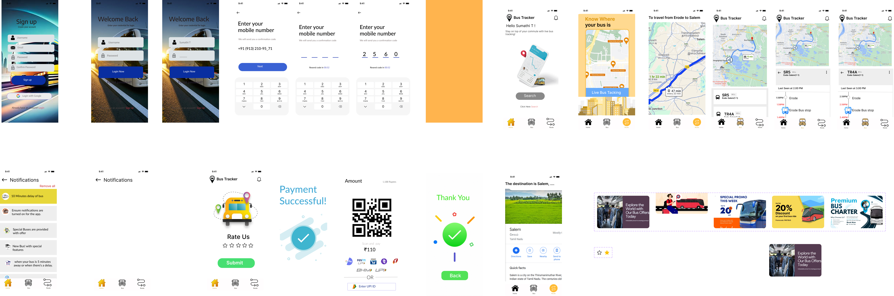

# 🚌 UI-UX-Design-Bus-Tracker

This repository contains a clean and user-friendly UI/UX design for a **Bus Tracking App**. Built in **Figma**, the app helps users track live bus locations, make bookings, and complete payments through QR, with an intuitive mobile-first interface.

---

## 🌟 Project Highlights

**🔐 Secure OTP Login** – Log in using mobile number and verification code.  
**📍 Live Bus Tracking** – View real-time routes and bus stops.  
**💳 QR Ticketing** – Scan QR codes to pay and confirm bookings.  
**🧾 Ride History** – View past trips, payments, and destinations.  

---

## 🎨 Design Info

- **Tool**: Figma  
- **Platform**: Mobile (iOS/Android)  
- **Prototype**: [View the Prototype](https://www.figma.com/proto/uLg9R6jqBkfRCRPVno9zx3/CAT-2?node-id=1-1010&t=lp6ZmQa89mM9LucY-1)

---

## BookHub -- Full Design View 🎨

---

## 📱 Screens Included

- Login & OTP  
- Home Dashboard  
- Route & Map View  
- Bus Tracking  
- QR Code Payment  
- Confirmation & Thank You  
- Offers & History

---
